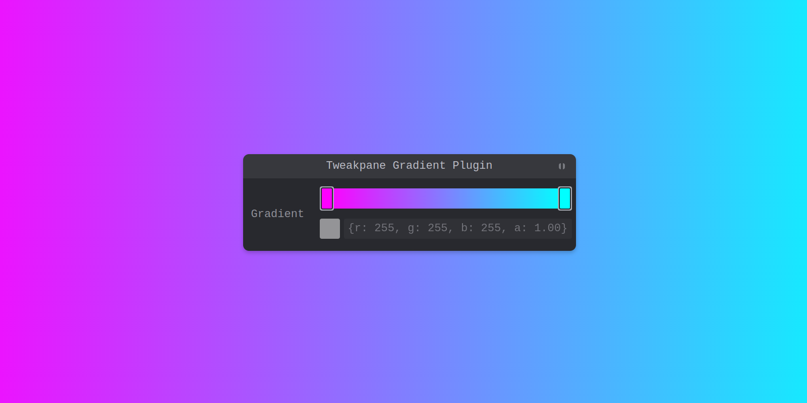

# Tweakpane-plugin-gradient



**Tweakpane-plugin-gradient** is a plugin for [Tweakpane](https://tweakpane.github.io/docs) that introduces a gradient picker as a new blade type, allowing users to create, visualize, and manage color gradients with ease.

[DEMO](https://dgxyzw.github.io/tweakpane-plugin-gradient/)

## Installation

```sh
npm install tweakpane-plugin-gradient
```

## Usage

To use the gradient blade in your Tweakpane instance, register the plugin and set up the gradient parameters:

```typescript
import { Pane } from 'tweakpane';
import { Gradient, GradientBladeApi, GradientPluginBundle } from 'tweakpane-plugin-gradient';

const pane = new Pane();
pane.registerPlugin(GradientPluginBundle);

const gradientParams = {
  view: 'gradient',
  initialPoints: [
    { time: 0, value: { r: 255, g: 0, b: 255, a: 1 } },
    { time: 1, value: { r: 0, g: 255, b: 255, a: 1 } },
  ],
  label: 'Gradient',
  colorPicker: true,
  colorPickerProps: {
    alpha: true,
    layout: 'popup',
    expanded: false,
  },
  alphaPicker: false,
  timePicker: false,
  timeStep: 0.001,
  timeDecimalPrecision: 4,
} satisfies GradientBladeApi;

const api = pane.addBlade(gradientParams);

api.on('change', (ev) => {
  console.log(ev.value.points);
  console.log(ev.value.points[0].time);
  console.log(ev.value.points[0].value.r);
  console.log(ev.value.points[0].value.g);
  console.log(ev.value.points[0].value.b);
  console.log(ev.value.points[0].value.a);
  console.log(ev.value.toCssGradient());
});

```

## Parameters

The following parameters allow you to customize the gradient picker to suit various needs.

### Base parameters

* **view** (string): Set to 'gradient' to initialize a gradient blade.
* **initialPoints**: Array of points defining the gradient colors and positions.
  * **time** (number): Position of the color stop in the gradient (0 to 1).
  * **value** (number): Object defining the RGBA color value (color 0-255, alpha 0-1).
* **label** (string): Sets the label displayed in Tweakpane for the gradient field.
* **timeStep** (number): Sets the increment for adjusting time values.
* **timeDecimalPrecision** (number): Defines the decimal precision for time adjustments
* 
### Color picker parameters

* **colorPicker** (boolean): Enables or disables the color picker for each gradient point.
* **colorPickerProps** (object): Additional configuration for the color picker.
  * **alpha** (boolean): Enables alpha transparency in the color picker.
  * **layout** ('inline' | 'popup'): Configures color picker layout, either as an inline or popup.
  * **expanded** (boolean): Sets whether the color picker is expanded by default in popup mode.

### Time picker parameters

* **timePicker** (boolean): Adds a control to adjust the time value for each color point, allowing precise placement.

### Alpha picker parameters

* **alphaPicker** (boolean): Enables an additional control to adjust alpha values independently.

## Gradient object


## Events

Listen for changes to the gradient to dynamically update the background or other UI elements:

```typescript
gradientApi.on('change', (event) => {
  document.body.style.background = event.value.toCssGradient();
});
```
